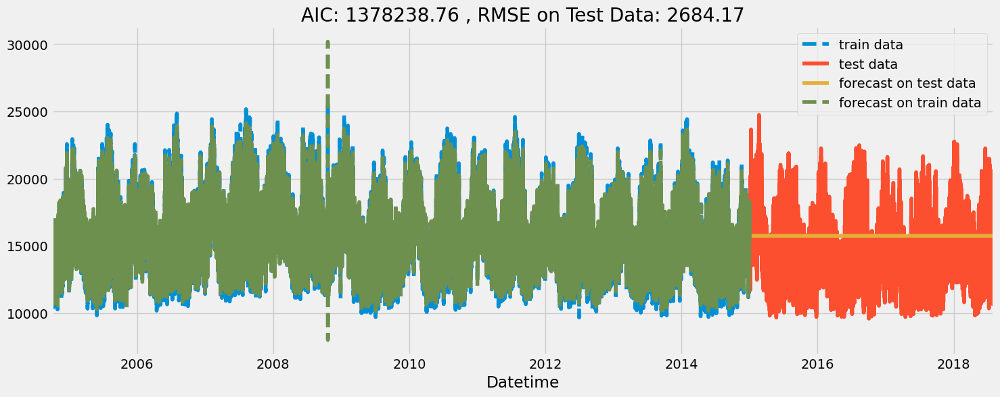

# Capstone Project Report

## Udacity School of Artificial Intelligence
## AWS Machine Learning Engineer Nanodegree

## AEP Hourly Energy Consumption Forecast

## Definition

### Project Overview
Time series forecasting is an area of machine learning/statistical methods that uses past data to forecast future value of a numerical variable. Time series analysis is a specific way of analyzing a sequence of data points collected over an interval of time. In time series analysis, analysts record data points at consistent intervals over a set period of time rather than just recording the data points intermittently or randomly. It is a very important problem in many professional fields including finance, sales, electricity, stocks, etc. In this capstone project, I built and deployed an ML model to forecast hourly power consumption for a a regional transmission organization in the United States - PJM. It is part of the Eastern Interconnection grid operating an electric transmission system serving all or parts of Delaware, Illinois, Indiana, Kentucky, Maryland, Michigan, New Jersey, North Carolina, Ohio, Pennsylvania, Tennessee, Virginia, West Virginia, and the District of Columbia. 

For this project, I used a publicly available energy consumption data from 2004 - 2018 available at https://www.kaggle.com/datasets/robikscube/hourly-energy-consumption/data provided by PJM Interconnection LLC (PJM). PJM is a regional transmission organization (RTO) in the United States. It is part of the Eastern Interconnection grid operating an electric transmission system serving all or parts of Delaware, Illinois, Indiana, Kentucky, Maryland, Michigan, New Jersey, North Carolina, Ohio, Pennsylvania, Tennessee, Virginia, West Virginia, and the District of Columbia. The hourly power consumption data comes from PJM's website and are in megawatts (MW). 

### Problem Statement
Accurate forecast of future energy consumption in an electrical power grid allows energy providers to balance power generation and consumption in real time to conserve resources at power plants and ensure grid stability. A significant mismatch of power generation and consumption in a power grid could lead to over-frequency or under-frequency in the grid, both of which could result in grid collapse, a term used in electrical engineering to refer to a situation where all generation stations connected to a grid are disconnected from the grid to preserve their health because they cannot supply power to the grid at the current grid frequency. Grid collapse can be very catastrophic for a modern society and often comes with significant financial losses for stake holders. 

### Evaluation Metrics
In the context of the domain, the following evaluation metrics will be used to judge the quality of models on unseen test data: 

MAE: Mean absolute error is how far away the forecasts are in comparison to the actual values in the time series. Its measured as the mean of the absolute error between all predictions and corresponding actual value. 

RMSE: Root mean square error also measures how far away the forecasts are in comparison to the actual values, but its the mean of the squares of the error between time-series values and correspond forecast. 

## Analysis

### Data Exploration and Visualization
The AEP dataset contains 14 years of hourly power consumption between October 2004 and August 2018. Initial analysis shows the mean value is around 15500MW with an inter-quartile range of 13629MW to 17200MW.

Time series decomposition allows to separately visualize the general trend of the time series, seasonality and random/white noise. The time series appears stationary with some level of white noise. Although a 4-season seasonality (likely corresponding to energy consumptions in fall, winter, spring and summer) is visually evident in the series (going by the peaks and troughs), the time series decomposition does not indicate any significant seasonality (observe the scale). This can be attributed to the extreme high frequency noise present in the series. This makes accurate time-series modelling and prediction very challenging.

### Algorithm and Techniques

My initial modelling approach included the  Auto-Regressive Integrated Moving Average (ARIMA) class of models. These are ML methods specifically designed to address time-series problems. The ARIMA methods treat time-series forecasting as a linear regression problem where forecast value of at time  depends on the past values or past errors of the same time series. This past values are called lags. Since there are infinite lags that could be used in forecasting and model training requires computation resources, its appropriate to determine which lags have the most significant correlation to the series. The ACF and PACF plots are good ways to identify the most predictive lags of a time series. Time series problem can also be treated as a regression problem by executing future engineering to generate features like hour, week, day, month, year from the date-time variable.

### Benchmark
A simple and commonly used benchmark model for time series forecasting is the simple moving average model. The Moving Average modelling of time-series is essentially a linear regression that makes use of the past error terms as predictors. Forecast (prediction) at any time in the future is the linear combination of weighted past residuals. The name should not be confused to mean moving average of past datapoints. Instead, it is the linear combination of past error terms. This is a basic model but it provides a useful benchmark against which other, more advanced models can be compared. 

## Methodology

### Data Preprocessing
The processing done on the dataset includes the following steps:

1.setting 'Datetime' as index
2.sorting index in ascending order
3.checking for missing hours in the time-series
4.resampling and filling missing hours with preceding hour's energy value 
5.generating features from the datetime for feature engineering

### Implementation
Implementation process involved the following:

#### Baseline Model - Moving Average

The Moving Average modelling of time-series is essentially a linear regression that makes use of the past error terms as predictors. Forecast (prediction) at any time in the future is the linear combination of weighted past residuals (errors). The name should not be confused to mean moving average of past datapoints. Instead, it is the linear combination of past error terms.
The number of lags to be used in MA is called the order of MA. And its selected to include lags that have the most statistically significant correlation to the series. Auto Correlation Function (ACF) plot is a bar chart of coefficients of correlation between a time series and its lags. In simple terms, ACF explains how the present value of a given time series is correlated with its past values (1-unit past,.…, n-unit past).
We can estimate the optimal order of MA from the ACF plot. It can be observed by how many lags are above or below the confidence interval (i.e have statistically significant correlation to the series).

On the x-axis are the lags of the series. On the y-axis are the correlations between each lag and the series. Correlation could be positive or negative ranging from 1 to -1. The light blue shaded region represent the confidence interval. 50 lags are above the confidence interval (i.e have statistically significant positive correlation with the series). Since each lag is a feature/predictor, I limited my q-parameter (order of MA) to 15. After seeing how much computation time and memory needed for 15 lags, I limited my order of MA to first 5 lags with the most correlations. 

All MA coefficients have p-values of less than 5% which means they are statistically significant or have enough predictive power to predict the target variable. The true value of the coefficients of the independent predictors lie within the confidence interval with a 95% likelihood. Each 'coef' represents the change in the output Y due to a change of one unit in the variable (everything else held constant). 'std err' reflects the level of accuracy of the coefficients. The lower it is, the more accurate the coefficients are. AIC (Akaike Information Criterion) is a measure of goodness of fit on the training data. BIC (Bayesian information criterion) or Schwarz information criterion (also SIC, SBC, SBIC) is a criterion for model selection (like AIC) among a finite set of models; models with lower BIC are generally preferred.

Predictions on unseen test data appear to quickly run towards the long-run mean of the series with RMSE of 2684MW. This is not a good fit.

#### Model 1 - AutoRegressive Model

In AR, the forecast of a series at time t is a linear function of the previous values of the same time series. The order p of an autoregression model is the number of lags in the series that are used to predict the value at the present time. The number of lags to be used in AR is called the order of AR. And its selected to include lags that have the most statistically significant correlation to the series. The PACF plot describes the partial correlation between the series and its own lags. The partial correlation for a lag is the unique correlation between the series and that lag after taking out the intervening correlations of other lags.
We estimated the optimal lags for AR Model from the PACF plot. It can be observed by how many lags are outside the confidence interval (i.e have statistically significant partial correlation with the series).

The light blue shaded region represent the confidence interval. Not so visible here because the confidence interval is very thin. Almost 50 lags have statistically significant partial-correlation to the series. Each lag is a potential feature/predictor. However its not advisable to build a model with all lags because it wont run in a reasonable time.
Lags 1, 2, 3, 23, 24, 25 and 26 have the most statistically significant partial-correlation. However, model building ran endlessly for the size of the train data.
After experimenting and seeing how much computation time and memory needed for different combinations of lags, I settle for the first 4 lags. There is always a need to factor in the computation demand of higher lags even if they have significant correlation to the series.

Predictions on unseen test data appear to quickly run towards the long-run mean of the series with RMSE of 2684MW. It appears the ARIMA class of modeling is not a good fit for this problem.

### Refinement
I refined my technique by approaching this as linear regression problem instead of a time-series problem. I engineered new features from the datetime. This appeared reasonable to me since things like day of the week, season of the year, month of the year etc have some correlation with how we tend to use electricity. I used the XGBoost regressor framework.

## Result

### Model Evaluation and Validation
The time series dataset was split into train/test at at ratio 3:1. The models were evaluated on the unseen test data. The refined model was able to forecast future hourly power consumption to within 36MW MAE. The regressor model forecast follows the trend of the unseen test data while the ARIMA models appear to forecast a constant value (the long running mean of the dataset). The xgboost regressor model is a far better predictive model than the ARIMA models both quantitavely and qualitatively.

### Justification

The refined model was able to forecast future hourly power consumption to within 36MW MAE, compared to the 2684MW with the ARIMA models. The regressor model forecast follows the trend and seasonality of the unseen test data while the ARIMA models appear to forecast a constant value (the long running mean of the dataset). The xgboost regressor model is a far better predictive model than the ARIMA models both quantitavely and qualitatively.

